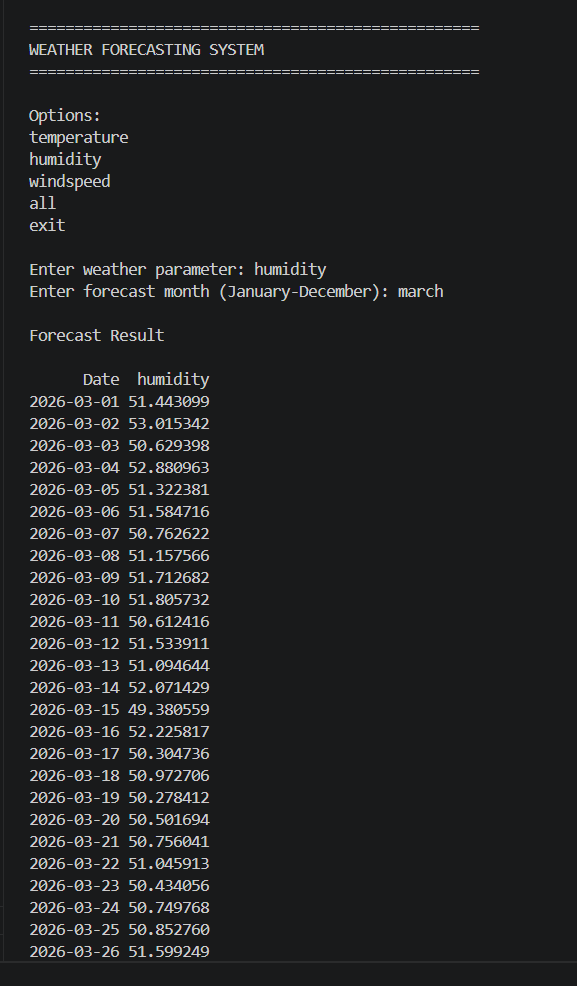
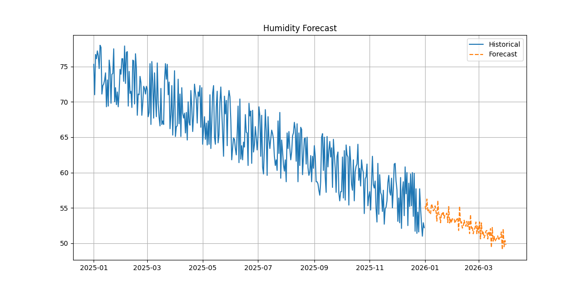

# Weather Forecasting

## Project Overview

This project predicts future weather conditions using Machine Learning and Time Series Analysis techniques. Historical weather data is used to train the forecasting model and predict future temperature trends.

## Technologies Used

* Python
* Pandas
* NumPy
* Matplotlib
* Scikit-Learn
* Streamlit

## Features

* Weather Data Analysis
* Time Series Forecasting
* Future Temperature Prediction
* Data Visualization
* Interactive Streamlit Interface

## Output Screenshots

### Output



### Forecast Graph



## Dataset

Dataset used in this project:

* weather.csv

## Project Structure

```text
Weather-Forecasting
│
├── app.py
├── forecast.py
├── generate_dataset.py
├── weather.csv
├── forecast_graph.png
├── output.png
├── requirements.txt
└── README.md
```

## Installation

Install required libraries:

```bash
pip install -r requirements.txt
```

## Run Project

Run Streamlit application:

```bash
streamlit run app.py
```

## Applications

* Weather Prediction
* Climate Analysis
* Environmental Monitoring
* Time Series Forecasting
* Data Analytics

## Author

Anbuselvan

# Weather-Forecasting

Weather Forecasting using Machine Learning and Time Series Analysis.

